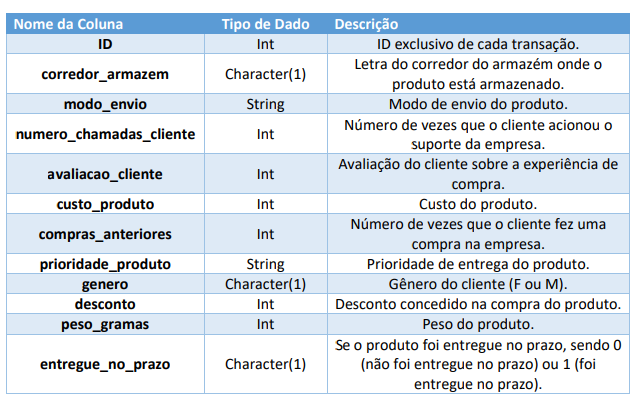

 

# Analise exploratória, data wrangling, engenharia de atributos e pré-processamento de dados para e-commerce.

  

# Definição do problema e fonte de dados
Uma empresa internacional de comércio eletrônico (E-commerce) que vende produtos eletrônicos deseja descobrir informações importantes de seu banco de dados de clientes. 
Os produtos ficam armazenados em um armazém na sede da empresa. Após concluir a compra no web site da empresa, o cliente recebe o produto em casa, em qualquer parte do 
mundo. Os produtos são enviados de Navio, Avião ou Caminhão, dependendo da região de 
entrega. 

Em cada compra o cliente pode receber um desconto dependendo do peso do produto comprado. Cada cliente pode fazer chamadas ao suporte da empresa no caso de dúvidas ou 
problemas e após receber o produto o cliente pode deixar uma avaliação sobre a experiência de  compra. O único dado pessoal sobre o cliente que está disponível é o gênero.

Nosso trabalho neste Estudo de Caso é explorar os dados, compreender como estão organizados, detectar eventuais problemas e analisar os dados por diferentes perspectivas.
Trabalharemos com dados fictícios que representam dados reais de uma empresa de E-commerce.

# Dicionário de dados

  

# Etapas abordadas no projeto
Este Estudo de Caso traz uma série de atividades em uma das tarefas mais importantes em Ciência de Dados, a Análise Exploratória.

Na Parte 1 do Estudo de Caso, a Análise Exploratória traz os detalhes técnicos com análise estatística, visualização  de  dados,  interpretação  de  gráficos  e  tabelas,  análise  univariada  e bivariada e relatório de conclusão.

Na Parte 2 o foco é na Análise Exploratória para responder perguntas de negócio, onde os dados são manipulados através de Data Wrangling com Pandas e analisados por diferentes perspectivas. Customização de gráficos é outro tema abordado durante as aulas. Todo  o  Estudo  de  Caso é  no  contexto  de  um  problema  de  negócio  em  E-Commerce Analytics.

Após a análise exploratória, aplicaremos a engenharia de atributos, cujo objetivo é analisar os dados por diferentes perspectivas e criar novas variáveis que ajudem a compreender o comportamento da variável alvo, em nosso caso se um produto será enviado com atraso ou não. Por fim, aplicaremos técnicas de pré-processamento de variáveis categóricas (Label Encoding e One-Hot Encoding) e Feature Scaling de variáveis numéricas (Normalização e Padronização).O objetivo é pré-processar os dados para uma etapa de modelagem preditiva.
